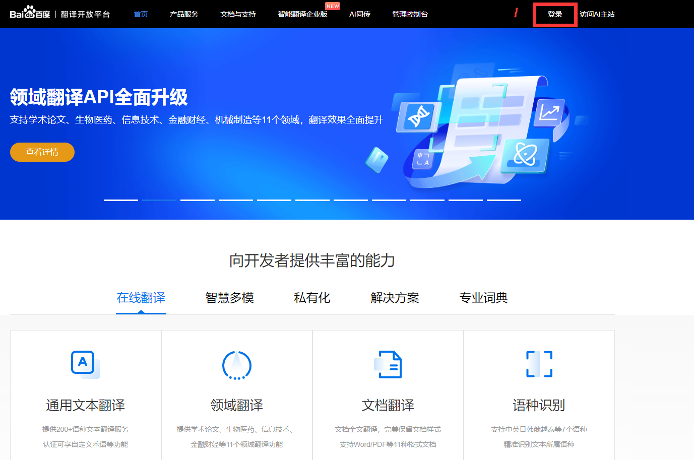
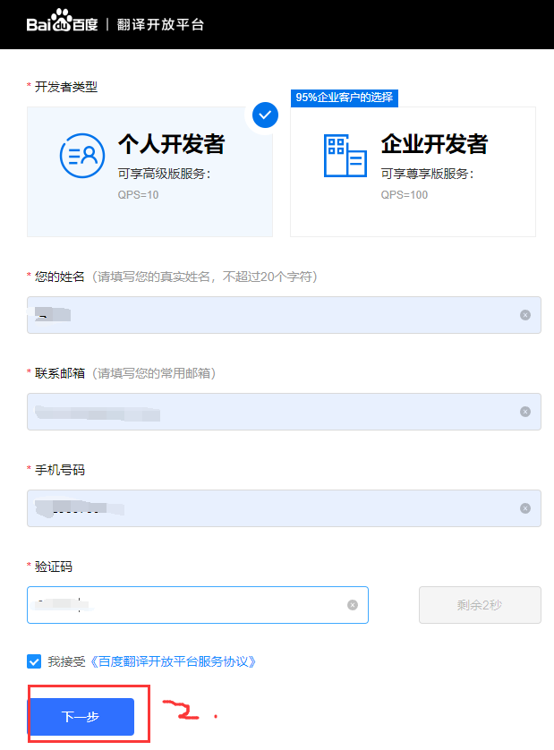
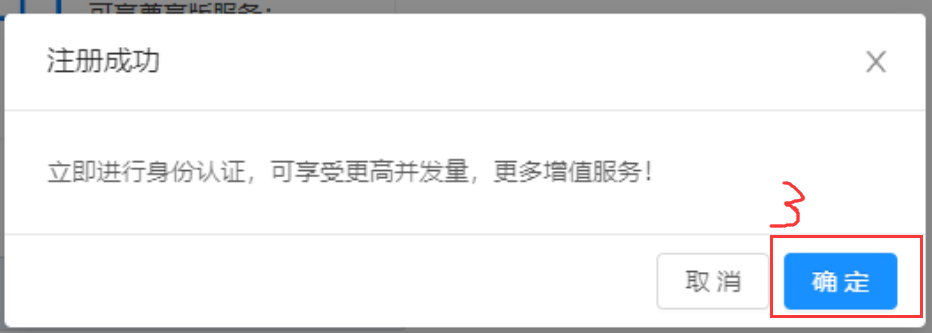
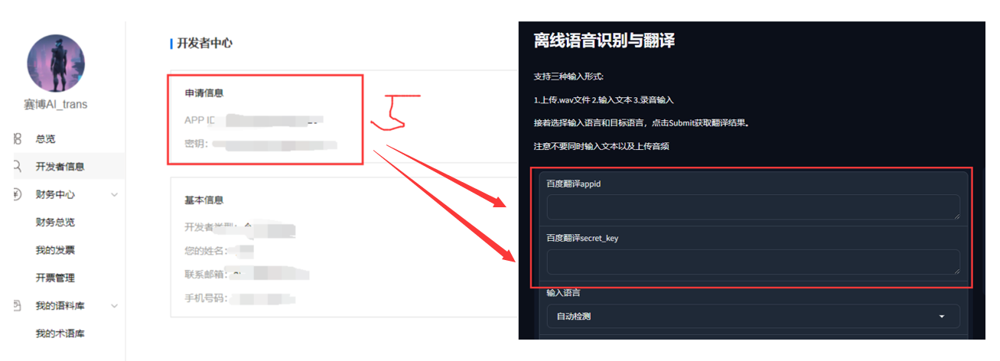

# 1 一键安装包
全语种语音识别和翻译一键安装包：

下载地址：

注意：
1. 自动检测语种可能会有识别错误
2. 请参考2.2配置百度翻译api key


# 2 给开发者的
## 2.1 环境
有conda环境可以通过以下代码启动
```bash
conda create -n ASR_trans python=3.10.13 -y
conda activate ASR_trans
pip install -r requirements.txt

```

接着上网去 https://huggingface.co/Systran/faster-whisper-large-v3

下载模型文件，存到models/faster-whisper-large-v3路径下，当然你也可以在offline_ASR_and_translate.py中自己更改路径。

## 2.2 配置

我目前的翻译功能用的是百度翻译api：http://api.fanyi.baidu.com

以下是配置步骤
1. 首先打开网址

2. 接着注册登录百度开发者


3. 输入信息


4. 确定


5. 请在webui中设置自己的appid和secret_key



## 2.3 使用
```bash
python offline_ASR_and_translate_webui
```
即可启动webui，启动后通常在http://127.0.0.1:7861使用。


# 3 作者留言处
1. 目前仅支持近30种语言
2. 模型加载时间较长，请耐心等待